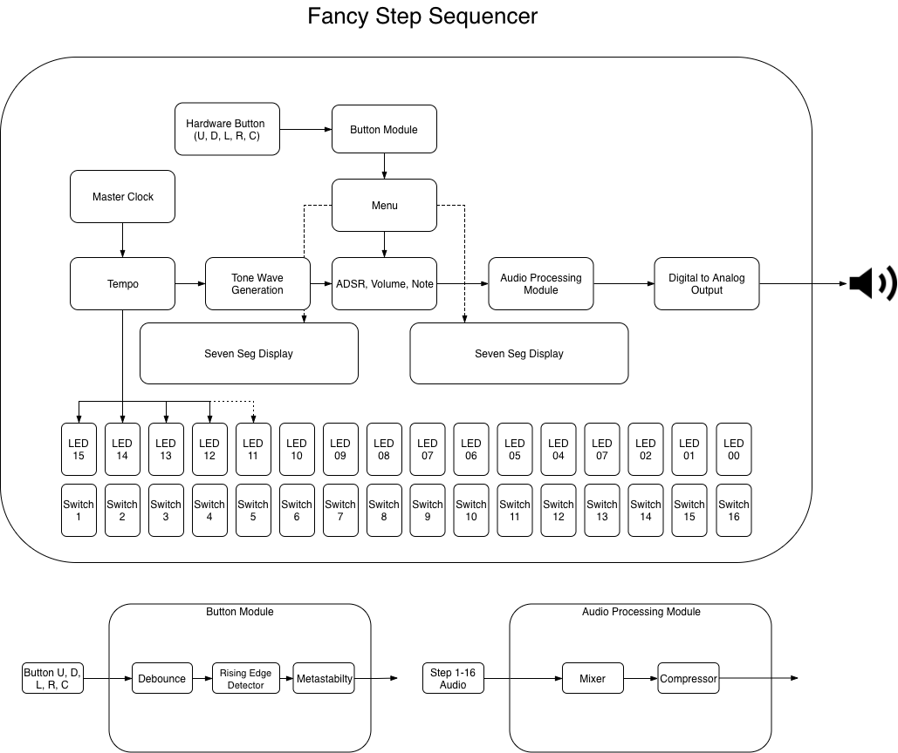
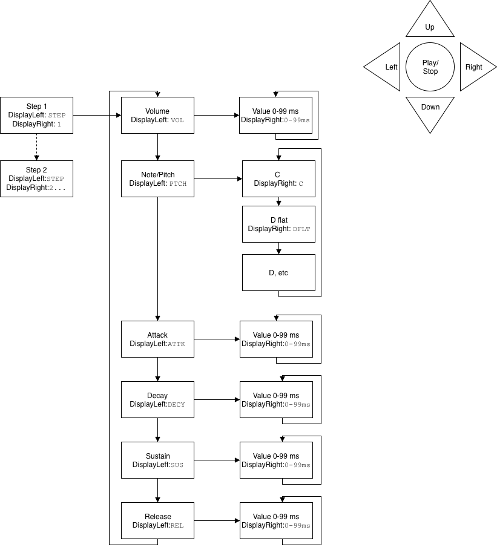

# 16-Step-Sequencer

### Introduction:  
For the the final term project, Alex and Nathaniel chose to attempt to create a musical synthesizer, highly influenced by the Korg Electribe series.  The EA-1 was an analog-emulating digital synthesizer produced in the late 90’s, featuring two polyphonic channels.

###### By Gerald Moore - Korg Electribe EA-1Uploaded by shoulder-synth, CC BY 2.0, https://commons.wikimedia.org/w/index.php?curid=8988831

### Design goals: 
We wished to use the EA-1 as an inspiration, as well as a heavy influence on the user interface.  To that extent, we intend to design the following:
16 channel polyphonic sequencer: 
1. 16 independent channels of sound, 
  * each with ADSR filter
  * 2 octave note range
  * sine, square, and noise waveforms
2. variable tempo control
3. fully functioning 7-segment display detailing menu options

### Block Diagram

### Menu Flowchart

